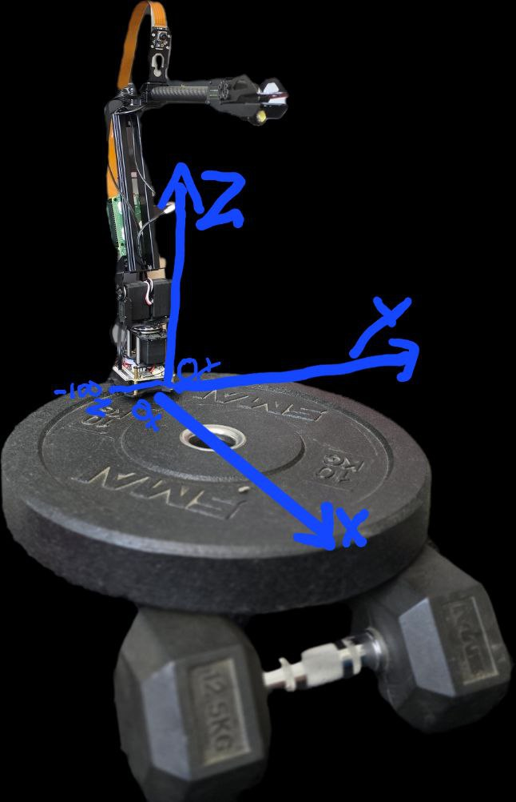

# hailo_robot
Software project for a Roarm-M2 robot arm using the Hailo-8 chip.

## Installation
Install the HailoRT python modules for Python 3.11 [https://github.com/hailo-ai/hailort]

pip install -r requirements.txt (in the hailort venv)

Be sure to add the following config to your .bashrc file:
```bash
source ~/hailort_env/bin/activate

export GEMINI_API_KEY=<GEMINI_API_KEY>

export TELEGRAM_TOKEN=<TELEGRAM_BOT_TOKEN>

export GOOGLE_APPLICATION_CREDENTIALS=<LOCATION_OF_CREDENTIALS_FILE_JSON>
```

## Usage
```bash
python main.py
```

## Features
* Uses the Hailo-8 chip for inference
* Supports multiple object detection models
* Can be controlled via a web interface

## Requirements
* Raspberry Pi with Hailo-8L chip
* Python 3.11 or higher
* HailoRT runtime library
* OpenCV - remember to use the raspbian version and DO NOT PIP install it

## Coordinate system


## YouTube
https://www.youtube.com/@IoTRobotThings/featured

## Contributing
Contributions are welcome! Please open an issue or submit a pull request.

## License
This project is licensed under the MIT License.

## Acknowledgements
This project is based on the Hailo-8 SDK and the OpenCV library.

## Disclaimer
This project is for educational purposes only. The author is not responsible for any damage or injury caused by the use of this project.

